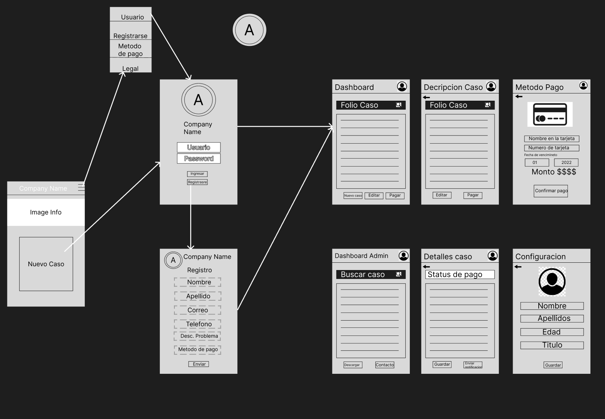

# Abogabot

## Descripcion de la actividad

Para la actividad se requiere una pagina web que capture los datos de un cliente con un formulario, que ademas se cree un inicio de sesion e impirma un numero de referencia para dar seguimiento al caso del abogado en aplicacion.

Por otro lado, se requiere tambien de una pagina para que el abogado pueda ver los caso almacenados de los clientes, ademas de ver las confirmaciones de pago.

## **Toma de requerimientos**

La toma de requerimientos general para la pagina web de la practica Abogabot debera contener lo siguiente:

**_UX de Cliente_**

- Creacion de cuenta cliente
- Formulario de captura de datos del caso
- Metodo de pago
- Numero de seguimiento de caso
- Notificacion de actualizacion de caso
- Observaciones de los comentarios del abogado
- Seccion de colores
- Responsiva para celular

**_UX de abogado_**

- Creacion de cuenta de administrador
- Resporte de casos en formulario
- Notificacion de nueva demanda
- Dashboard con datos y cumplimineto de pago
- Agregar comentarios y actualizacion
- Envio de notificaciones al cliente
- Seleccion de colores
- Responsiva para celular

Siguiendo con nuestro toma de requerimientos, mostramos el diagrama de flujo propuesto para la aplicacion:

## **1.- Buyer Persona**

Se define el cliente ideal, el cual es representado por el abogado administrador

Para llevar a cabo esta practica, se utlizo el documento en word porporcionado por LaunchX

## **2.- Publico objetivo**

Para el publico objetivo se define como los posiblesc ompradores del servicio y las necesidades de las cuales partir para solucionar sus problemas

Se utiliza la plantilla proporcionada en la pagina web https://miro.com/app/board/uXjVPQS88bs=/

## **3.- Primer Wireframe**

Se muestra el borrador del wireframe con los requerimientos de la practica.

Se hizo uso de la plataforma FIGMA

## **4.- UI Abogabot**

Se concluye con el diseño UI realizado en Figma, el cual mostrara los requerimientos mencionados, lo mustro acontinuacion: [Prototipo Figma] (https://www.figma.com/file/sAuMxTzxzSQzsumyxopApo/UI-Cliente)

Con esta applicacion web, se realiza el diseño y la distribucion de cada componente, tambien hacemos uso de colores conforme a la empresa.

Aqui mostramos de manera general como quedaria cada area con su respectivo diseño

