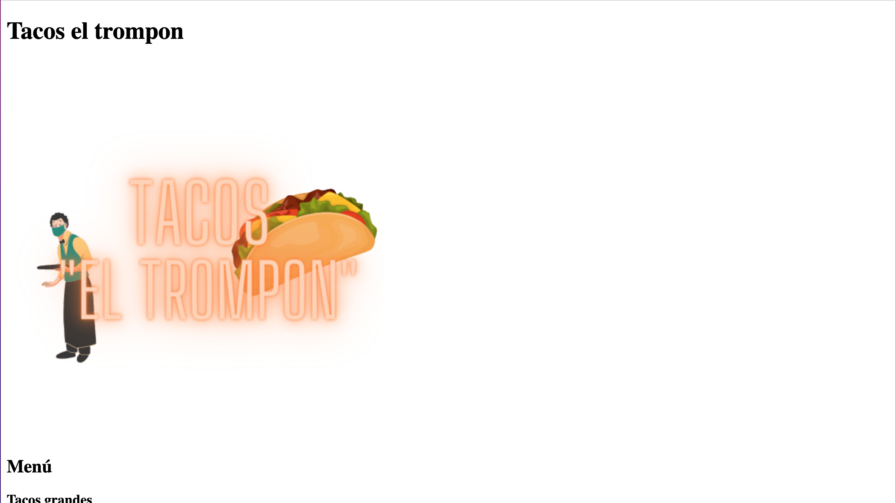

# Practicas HTML

## Descripcion de la actividad

Para la actividad pastelería se requiere una pagina web que capture los datos de un cliente con un formulario, muestre los datos capturados en otro formulario para el admin, muestre información sobre, sabores, adornos, contacto y un logo.

## **Página principal**

En la página index, encontramos información general de los productos que ofrece la pastelería:

## **Index pastelería**

## **Sección pedidos**

En la página pedidos, se encuentra el formulario para realizar el pedido del tipo de pastel que se requiere.

## **Sección Admin**

En la página Admin, nos encontramos con información de los pedidos relizados y la cantidad de producto que sobra en el almacen.

## **Práctica taquería**

En esta sección, se muestra la práctica realizada en una sesión, que fue hacer una página para una taquería.

